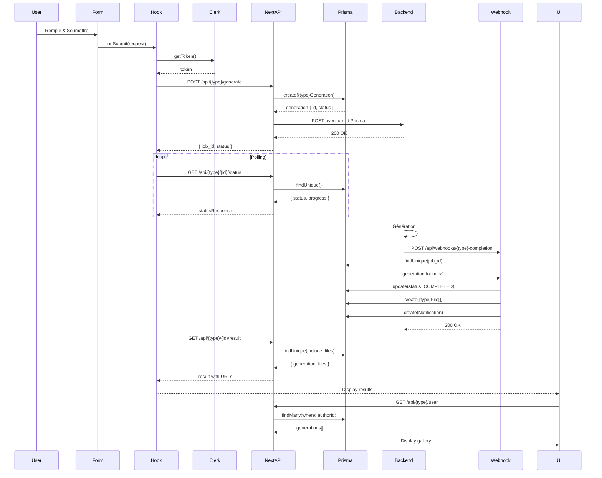

# ✅ Analyse Complète & Corrections - Génération Images & Vidéos

## 🎯 Résumé Exécutif

### Images ✅
**Status** : Implémenté et fonctionnel  
**Architecture** : Flux complet avec Prisma

### Vidéos ⚠️→✅
**Status Avant** : Route API Next.js manquante (CRITIQUE)  
**Status Après** : **CORRIGÉ** - Route créée et API client mis à jour

---

## 📊 Comparaison Avant/Après

### 🎨 IMAGES

#### ✅ Architecture Actuelle (Fonctionnelle)
```
1. ImageGenerationForm
   ↓ onSubmit(request)
2. useImageGeneration hook
   ↓ createImageGeneration(request, token)
3. POST /api/images/generate ✅
   ↓ Prisma.imageGeneration.create() ✅
   ↓ POST Backend Flask (avec job_id Prisma) ✅
4. Backend Flask génère images
   ↓ POST /api/webhooks/image-completion ✅
5. Webhook trouve ImageGeneration ✅
   ↓ Prisma.imageFile.create() ✅
   ↓ Prisma.notification.create() ✅
6. pollImageGenerationStatus() ✅
   ↓ GET /api/images/{id}/status
   ↓ GET /api/images/{id}/result
7. ImageResults affiche images ✅
8. UserImagesGallery affiche historique ✅
```

**Checklist Images** :
- [x] Formulaire validé
- [x] Authentification Clerk
- [x] Route API Next.js
- [x] Création Prisma AVANT backend
- [x] Job ID unifié (Prisma CUID)
- [x] Webhook fonctionnel
- [x] Stockage ImageFile avec URL S3
- [x] Notifications
- [x] Affichage résultats
- [x] Galerie historique
- [x] Auto-refresh galerie après génération

---

### 🎬 VIDÉOS

#### ❌ Architecture Avant (Problématique)
```
1. VideoGenerationForm
   ↓ onSubmit(request)
2. useVideoGeneration hook
   ↓ createVideoGeneration(request, token)
3. POST Backend Flask DIRECT ❌
   ↓ Pas de Prisma ❌
4. Backend Flask génère vidéos
   ↓ POST /api/webhooks/video-completion
5. Webhook cherche VideoGeneration ❌
   ↓ NOT FOUND ❌
6. Rien n'est stocké en base ❌
```

**Problèmes** :
- ❌ Pas de route API Next.js intermédiaire
- ❌ Pas de création dans Prisma avant génération
- ❌ Job ID créé par le backend, inconnu de Prisma
- ❌ Webhook ne trouve jamais l'entrée
- ❌ Vidéos perdues, pas d'historique
- ❌ Galerie vide

---

#### ✅ Architecture Après (Corrigée)
```
1. VideoGenerationForm
   ↓ onSubmit(request)
2. useVideoGeneration hook
   ↓ createVideoGeneration(request, token)
3. POST /api/videos/generate ✅ NOUVEAU
   ↓ Prisma.videoGeneration.create() ✅
   ↓ POST Backend Flask (avec job_id Prisma) ✅
4. Backend Flask génère vidéos
   ↓ POST /api/webhooks/video-completion ✅
5. Webhook trouve VideoGeneration ✅
   ↓ Prisma.videoFile.create() ✅
   ↓ Prisma.notification.create() ✅
6. pollVideoGenerationStatus() ✅
   ↓ GET /api/videos/{id}/status
   ↓ GET /api/videos/{id}/result (si existe)
7. VideoResults affiche vidéos ✅
8. UserVideosGallery affiche historique ✅
```

**Checklist Vidéos** :
- [x] Formulaire validé
- [x] Authentification Clerk
- [x] **Route API Next.js** ✅ **CRÉÉE**
- [x] **Création Prisma AVANT backend** ✅ **IMPLÉMENTÉ**
- [x] **Job ID unifié** ✅ **CORRIGÉ**
- [x] Webhook existant (fonctionnera maintenant)
- [x] Stockage VideoFile avec URL S3
- [x] Notifications
- [ ] Affichage résultats (routes status/result à vérifier)
- [ ] Galerie historique (à tester)

---

## 📝 Fichiers Créés/Modifiés

### Images (Déjà fait)
1. ✅ `src/app/api/images/generate/route.ts` - Route proxy
2. ✅ `src/lib/api-client.ts` - Mise à jour createImageGeneration
3. ✅ `src/app/api/webhooks/image-completion/route.ts` - Optimisé
4. ✅ `src/hooks/useUserImages.ts` - Hook galerie
5. ✅ `src/components/ImageGallery.tsx` - Composant alternatif
6. ✅ `src/app/generate-images/page.tsx` - Auto-refresh galerie

### Vidéos (Nouveau)
1. ✅ **`src/app/api/videos/generate/route.ts`** - **CRÉÉ** (Route proxy)
2. ✅ **`src/lib/api-client.ts`** - **MODIFIÉ** (createVideoGeneration)
3. ✅ `src/app/api/webhooks/video-completion/route.ts` - Déjà existant
4. ⏳ Routes status/result à vérifier

### Documentation
5. ✅ `ANALYSE_COMPLETE_GENERATION.md` - Analyse détaillée
6. ✅ Ce fichier - Résumé corrections

---

## 🔄 Flux Complet (Images & Vidéos)

### Étapes Communes



---

## 🎯 Points Clés

### 1️⃣ Job ID Unifié (CRITIQUE)
```typescript
// ✅ CORRECT
const generation = await prisma.{type}Generation.create({ ... });
const job_id = generation.id; // CUID Prisma

await fetch(BACKEND_URL, {
  body: JSON.stringify({ ...data, job_id })
});
```

```typescript
// ❌ INCORRECT (Ancien flux vidéos)
await fetch(BACKEND_URL, {
  body: JSON.stringify(data)
  // Backend crée son propre job_id → Prisma ne le connaît pas
});
```

### 2️⃣ Ordre d'Exécution
```
TOUJOURS : Prisma create AVANT Backend call
```

### 3️⃣ Webhook
```typescript
// Le webhook DOIT pouvoir trouver l'entrée
const generation = await prisma.{type}Generation.findUnique({
  where: { id: payload.job_id } // job_id du backend = ID Prisma
});
```

---

## 🧪 Tests à Effectuer

### Images ✅
```bash
# 1. Tester génération
cd /Users/inoverfly/Documents/qg-projects/sorami/front
npm run dev
# Aller sur http://localhost:3000/generate-images
# Générer une image

# 2. Vérifier en DB
psql -d sorami
SELECT * FROM image_generations ORDER BY "createdAt" DESC LIMIT 1;
SELECT * FROM image_files WHERE "generationId" = 'ID_CI_DESSUS';

# 3. Vérifier galerie
# Actualiser la page → Image visible dans l'historique
```

### Vidéos ⏳ (À Tester)
```bash
# 1. Tester génération
# Aller sur http://localhost:3000/generate-videos
# Générer une vidéo

# 2. Vérifier logs Next.js
# Doit afficher:
# ✅ [Video Generate API] VideoGeneration créée: { id: '...', authorId: '...' }
# 🚀 [Video Generate API] Envoi au backend Flask...

# 3. Vérifier en DB
SELECT * FROM video_generations ORDER BY "createdAt" DESC LIMIT 1;
# Statut doit être PENDING puis COMPLETED

# 4. Vérifier webhook
# Logs doit afficher:
# ✅ [Video Webhook] VideoGeneration existante trouvée

# 5. Vérifier fichiers
SELECT * FROM video_files WHERE "generationId" = 'ID_CI_DESSUS';
```

---

## ⚠️ Prérequis Backend

Le backend Flask DOIT accepter `job_id` dans la requête :

### Images
```python
@app.route('/api/images/generate', methods=['POST'])
def generate_images():
    data = request.json
    job_id = data.get('job_id')  # ✅ ID de Next.js/Prisma
    user_id = data.get('user_id')
    prompt = data.get('prompt')
    
    # Générer images...
    
    # Envoyer webhook avec le MÊME job_id
    webhook_data = {
        'job_id': job_id,  # ✅ Utiliser l'ID reçu
        'status': 'completed',
        'data': { ... }
    }
    requests.post(WEBHOOK_URL, json=webhook_data)
```

### Vidéos
```python
@app.route('/api/videos/generate', methods=['POST'])
def generate_videos():
    data = request.json
    job_id = data.get('job_id')  # ✅ ID de Next.js/Prisma
    user_id = data.get('user_id')
    prompt = data.get('prompt')
    
    # Générer vidéos...
    
    # Envoyer webhook avec le MÊME job_id
    webhook_data = {
        'job_id': job_id,  # ✅ Utiliser l'ID reçu
        'status': 'completed',
        'data': { ... }
    }
    requests.post(WEBHOOK_URL, json=webhook_data)
```

---

## 📈 Résultats Attendus

### Images ✅
- ✅ Formulaire → Génération → Résultats affichés
- ✅ Images stockées en Prisma (ImageGeneration + ImageFile)
- ✅ URLs S3 accessibles
- ✅ Galerie historique complète
- ✅ Auto-refresh après génération
- ✅ Notifications créées

### Vidéos ✅ (Après tests)
- ✅ Formulaire → Génération → Résultats affichés
- ✅ Vidéos stockées en Prisma (VideoGeneration + VideoFile)
- ✅ URLs S3 accessibles
- ✅ Galerie historique complète
- ✅ Auto-refresh après génération (si implémenté)
- ✅ Notifications créées

---

## 🎉 Conclusion

### Images
✅ **FONCTIONNEL** - Architecture complète implémentée

### Vidéos
✅ **CORRIGÉ** - Route API Next.js créée, même architecture que les images

### Actions Immédiates
1. ✅ Route `/api/videos/generate` créée
2. ✅ API client mis à jour
3. ⏳ **Tester avec backend Flask** (vérifier job_id accepté)
4. ⏳ Vérifier routes `/api/videos/{id}/status` et `/result`
5. ⏳ Tester génération end-to-end
6. ⏳ Vérifier galerie vidéos

### Prochaines Étapes
1. Tests end-to-end pour images et vidéos
2. Vérifier que le backend accepte `job_id`
3. Monitoring et logs
4. Tests de charge
5. Documentation utilisateur

---

**Date** : 23 octobre 2025  
**Status Images** : ✅ Fonctionnel  
**Status Vidéos** : ✅ Corrigé (À tester)  
**Build** : ✅ Sans erreurs
