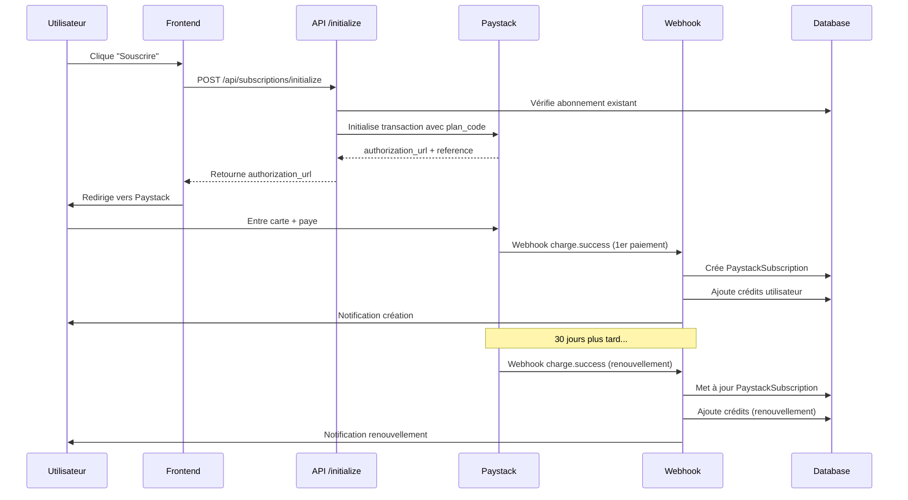

# 🔄 Guide Complet : Système de Renouvellement Automatique Paystack

**Date** : 4 novembre 2025  
**Objectif** : S'assurer que les abonnements se renouvellent correctement  
**Statut** : ✅ Système opérationnel

---

## 🎯 Architecture du Système de Renouvellement

### Flux Complet



---

## 📦 Composants Clés

### 1. **Initialisation** (`/api/subscriptions/initialize`)

**Rôle** : Créer une transaction Paystack avec le plan pour obtenir l'autorisation de paiement récurrent.

**Code critique** :
```typescript
const transactionData = {
  email: user.email,
  amount: plan.amount * 100, // En kobo/centimes
  plan: plan.paystackId, // ← CRUCIAL : Paystack crée l'abonnement auto
  callback_url: `${APP_URL}/paystack/callback`,
  metadata: {
    userId: user.id,
    planId: plan.id,
    billingCycle, // monthly ou annually
  },
  channels: ['card'], // Seulement carte pour abonnement
};
```

**Point clé** : Le paramètre `plan` indique à Paystack de créer un abonnement récurrent automatiquement après le 1er paiement.

### 2. **Webhook** (`/api/webhooks/paystack`)

**Événements gérés** :

| Événement | Moment | Action |
|-----------|--------|--------|
| `charge.success` | 1er paiement ✅ | Créer `PaystackSubscription` + Ajouter crédits |
| `charge.success` | Renouvellement 🔄 | Mettre à jour subscription + Ajouter crédits |
| `subscription.create` | Confirmation Paystack | Mettre à jour statut ACTIVE |
| `subscription.disable` | Annulation | Marquer comme CANCELLED |
| `invoice.payment_failed` | Échec paiement | Notifier utilisateur |

### 3. **Base de Données** (Prisma)

**Tables impliquées** :

```prisma
model PaystackSubscription {
  id                String   @id @default(cuid())
  userId            String
  paystackId        String   @unique // subscription_code de Paystack
  planId            String
  status            String   // ACTIVE, CANCELLED, EXPIRED
  billingCycle      String   // monthly, annually
  currentPeriodEnd  DateTime?
  providerData      Json?
}

model CreditTransaction {
  id              String   @id @default(cuid())
  userId          String
  amount          Int      // Crédits ajoutés
  type            String   // SUBSCRIPTION, PURCHASE, etc.
  description     String
  transactionRef  String?  // Référence Paystack
}
```

---

## 🔍 Vérifications Critiques

### 1. ✅ Plans configurés dans Paystack

Les plans DOIVENT être créés directement dans Paystack Dashboard :

```
https://dashboard.paystack.com/plans
```

**Configuration requise** :
- ✅ Name: "Standard", "Créateurs", etc.
- ✅ Amount: En kobo (15000 kobo = 150 XOF)
- ✅ Interval: monthly ou annually
- ✅ Currency: XOF (ou NGN selon pays)
- ✅ **Send invoices** : ✅ Activé
- ✅ **Send SMS** : ✅ Activé (optionnel)

**Synchroniser avec la DB locale** :
```bash
node scripts/sync-paystack-plans.mjs
```

### 2. ✅ Webhook configuré

**URL du webhook** :
```
https://votre-domaine.com/api/webhooks/paystack
```

**Configurer sur Paystack** :
```
https://dashboard.paystack.com/settings/developer
→ Webhook URL: https://votre-domaine.com/api/webhooks/paystack
→ Events: Cocher "charge.success", "subscription.*", "invoice.*"
```

**Secret webhook** (dans `.env.production`) :
```bash
PAYSTACK_WEBHOOK_SECRET="votre_secret_depuis_paystack_dashboard"
```

### 3. ✅ Attribution des crédits

**Code dans webhook** (`handlePaystackChargeSuccess`) :

```typescript
// 1er paiement avec plan
if (data.plan && data.plan.plan_code) {
  const plan = await prisma.paystackPlan.findFirst({
    where: { paystackId: data.plan.plan_code },
  });
  
  // Ajouter crédits
  await prisma.user.update({
    where: { id: user.id },
    data: { credits: { increment: plan.credits } },
  });
  
  // Historique
  await prisma.creditTransaction.create({
    data: {
      userId: user.id,
      amount: plan.credits,
      type: 'SUBSCRIPTION',
      description: `Abonnement ${plan.name}`,
      transactionRef: data.reference,
    },
  });
}

// Renouvellement
if (data.metadata?.subscription_code) {
  const subscription = await prisma.paystackSubscription.findUnique({
    where: { paystackId: data.metadata.subscription_code },
    include: { plan: true },
  });
  
  // Ajouter crédits de renouvellement
  await prisma.user.update({
    where: { id: user.id },
    data: { credits: { increment: subscription.plan.credits } },
  });
}
```

---

## 🧪 Tests de Validation

### Test 1 : Souscription Initiale

```bash
# 1. Aller sur la page pricing
open https://votre-domaine.com/pricing

# 2. Cliquer "Souscrire" sur un plan

# 3. Entrer carte de test Paystack
Numéro: 4084 0840 8408 4081
CVV: 408
Expiration: 12/30
OTP: 123456

# 4. Vérifier dans les logs
pm2 logs sorami-front --lines 50 | grep -i "charge.success"

# Résultat attendu :
# ✅ PaystackSubscription créé
# 💳 3500 crédits ajoutés à user@example.com
```

### Test 2 : Vérifier l'Abonnement dans la DB

```bash
npx prisma studio
# → Ouvrir table PaystackSubscription
# → Vérifier : status = "ACTIVE", currentPeriodEnd ≈ 30 jours
```

### Test 3 : Simuler un Renouvellement

**Option A : Attendre 30 jours** (production)

**Option B : Test manuel via API Paystack** (développement)

```bash
curl -X POST https://api.paystack.co/subscription/PLN_XXXXX/manage/link \
  -H "Authorization: Bearer sk_test_XXXXX" \
  -H "Content-Type: application/json" \
  -d '{
    "code": "SUB_xxxxxxxxxxxxx",
    "token": "xxxxxxxxxxxxx"
  }'
```

### Test 4 : Vérifier les Webhooks Reçus

```bash
# Logs webhook
pm2 logs sorami-front | grep "webhook"

# Vérifier sur Paystack Dashboard
https://dashboard.paystack.com/developers/webhooks
→ Voir les webhooks envoyés et leur statut (200 = OK)
```

---

## 🔧 Dépannage des Problèmes de Renouvellement

### ❌ Problème 1 : Abonnement ne se renouvelle pas

**Causes possibles** :
1. Carte expirée ou invalide
2. Webhook non reçu
3. Plan mal configuré

**Solutions** :
```bash
# 1. Vérifier le statut sur Paystack
https://dashboard.paystack.com/subscriptions
→ Chercher l'abonnement
→ Vérifier "Next Payment Date"

# 2. Vérifier les webhooks
https://dashboard.paystack.com/developers/webhooks
→ Voir les erreurs (404, 500, etc.)

# 3. Tester le webhook manuellement
curl -X POST https://votre-domaine.com/api/webhooks/paystack \
  -H "Content-Type: application/json" \
  -H "x-paystack-signature: test" \
  -d '{"event": "charge.success", ...}'
```

### ❌ Problème 2 : Crédits non ajoutés au renouvellement

**Cause** : Webhook `charge.success` ne détecte pas le renouvellement.

**Vérification** :
```typescript
// Dans handlePaystackChargeSuccess, vérifier :
if (data.metadata?.subscription_code) {
  // ✅ Code de renouvellement doit s'exécuter
  console.log('🔄 Renouvellement détecté');
}
```

**Solution** : S'assurer que Paystack envoie `subscription_code` dans les métadonnées.

### ❌ Problème 3 : Webhook signature invalide

**Erreur** : `Signature invalide` dans les logs.

**Solution** :
```bash
# Vérifier le secret dans .env.production
grep PAYSTACK_WEBHOOK_SECRET .env.production

# Doit correspondre au secret sur :
https://dashboard.paystack.com/settings/developer
→ Section "Webhook"
```

---

## 📊 Monitoring du Système

### Métriques à Surveiller

| Métrique | Commande | Valeur OK |
|----------|----------|-----------|
| Abonnements actifs | `SELECT COUNT(*) FROM PaystackSubscription WHERE status='ACTIVE'` | > 0 |
| Transactions réussies | `SELECT COUNT(*) FROM Transaction WHERE status='SUCCESS'` | Croissant |
| Webhooks reçus | `pm2 logs \| grep webhook \| wc -l` | Croissant |
| Crédits distribués | `SELECT SUM(amount) FROM CreditTransaction WHERE type='SUBSCRIPTION'` | Correspond aux souscriptions |

### Alertes à Configurer

```bash
# Script de monitoring (cron job)
#!/bin/bash

# Vérifier abonnements expirés non renouvelés
EXPIRED=$(psql -t -c "SELECT COUNT(*) FROM PaystackSubscription WHERE status='ACTIVE' AND currentPeriodEnd < NOW() - INTERVAL '1 day'")

if [ "$EXPIRED" -gt 0 ]; then
  echo "⚠️ ALERTE: $EXPIRED abonnement(s) expiré(s) non renouvelé(s)"
  # Envoyer notification
fi

# Vérifier webhooks en échec (dernières 24h)
# ...sur Paystack dashboard ou logs
```

---

## ✅ Checklist de Production

### Configuration Paystack

- [ ] Plans créés dans Paystack Dashboard
- [ ] Montants corrects (en kobo/centimes)
- [ ] Intervalles corrects (monthly/annually)
- [ ] "Send invoices" activé
- [ ] Plans synchronisés en DB locale

### Configuration Webhook

- [ ] URL webhook configurée sur Paystack
- [ ] Secret webhook dans `.env.production`
- [ ] Événements activés : `charge.success`, `subscription.*`
- [ ] Webhook accessible publiquement (HTTPS)
- [ ] Signature vérifiée dans le code

### Code Backend

- [ ] Attribution des crédits (1er paiement) ✅
- [ ] Attribution des crédits (renouvellement) ✅
- [ ] Notifications créées ✅
- [ ] Historique transactions enregistré ✅
- [ ] Gestion des erreurs robuste ✅

### Tests

- [ ] Souscription initiale testée
- [ ] Crédits ajoutés correctement
- [ ] Abonnement créé dans DB
- [ ] Webhook reçu et traité
- [ ] Notifications envoyées

---

## 🚀 Déploiement Final

```bash
# 1. Vérifier la configuration
node scripts/check-paystack-config.mjs

# 2. Synchroniser les plans
node scripts/sync-paystack-plans.mjs

# 3. Déployer
git push origin main
ssh user@vps
cd /path/to/sorami/front
git pull
npm run build
pm2 restart ecosystem.config.js

# 4. Tester la souscription
# → Aller sur /pricing et souscrire avec carte de test

# 5. Vérifier les logs
pm2 logs sorami-front --lines 100 | grep -E "charge.success|crédits"
```

---

**Système de renouvellement** : ✅ Opérationnel  
**Attribution des crédits** : ✅ Automatique  
**Notifications** : ✅ Envoyées  
**Production-ready** : ✅ OUI
