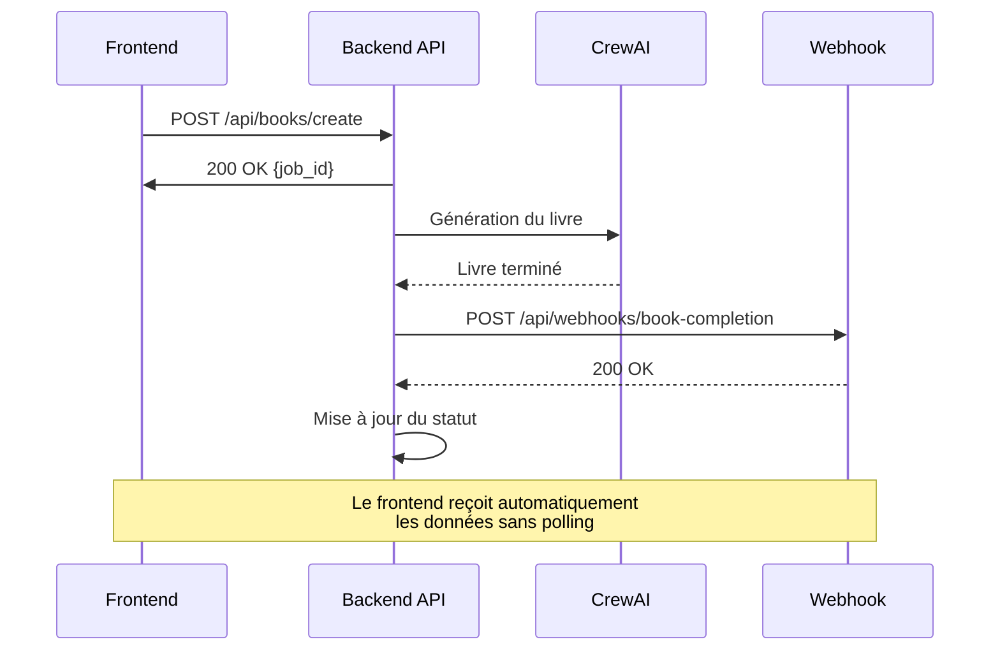

# 🔔 Documentation du Système de Webhook

## Vue d'ensemble

Le système de webhook permet au backend d'envoyer automatiquement les données du livre généré au frontend dès que la création est terminée. Cela évite au frontend de faire du polling constant et améliore considérablement l'efficacité du système.

---

## 🌍 Configuration par Environnement

### Mode DÉVELOPPEMENT (par défaut)

```bash
ENVIRONMENT=development
WEBHOOK_URL=http://localhost:3000/api/webhooks/book-completion
```

**Caractéristiques :**
- ✅ Pas d'en-tête de sécurité requis
- ✅ URL locale du frontend
- ✅ Parfait pour le développement et les tests
- ✅ Logs détaillés pour le débogage

**Requête envoyée :**
```bash
curl -X POST http://localhost:3000/api/webhooks/book-completion \
  -H "Content-Type: application/json" \
  -d '{
    "job_id": "abc-123-def",
    "status": "completed",
    "timestamp": "2025-10-20T14:30:00",
    "environment": "development",
    "book_data": {
      "book_title": "Mon Livre",
      "topic": "Sujet du livre",
      "goal": "Objectif du livre",
      "outline": [...],
      "chapters": [...],
      "generated_at": "2025-10-20T14:30:00",
      "word_count": 15000,
      "chapter_count": 5
    }
  }'
```

---

### Mode PRODUCTION

```bash
ENVIRONMENT=production
WEBHOOK_URL=https://votre-domaine.com/api/webhooks/book-completion
WEBHOOK_SECRET=sorami-webhook-secret-key-2025
```

**Caractéristiques :**
- 🔒 En-tête `X-Webhook-Secret` automatiquement ajouté
- 🔒 Authentification sécurisée
- 🔒 URL du domaine de production
- 🔒 Protection contre les requêtes non autorisées

**Requête envoyée :**
```bash
curl -X POST https://votre-domaine.com/api/webhooks/book-completion \
  -H "Content-Type: application/json" \
  -H "X-Webhook-Secret: sorami-webhook-secret-key-2025" \
  -d '{
    "job_id": "abc-123-def",
    "status": "completed",
    "timestamp": "2025-10-20T14:30:00",
    "environment": "production",
    "book_data": {
      "book_title": "Mon Livre",
      "topic": "Sujet du livre",
      "goal": "Objectif du livre",
      "outline": [...],
      "chapters": [...],
      "generated_at": "2025-10-20T14:30:00",
      "word_count": 15000,
      "chapter_count": 5
    }
  }'
```

---

## 📦 Structure des Données Envoyées

### Payload du Webhook

```json
{
  "job_id": "uuid-du-job",
  "status": "completed",
  "timestamp": "2025-10-20T14:30:00.000Z",
  "environment": "development|production",
  "book_data": {
    "book_title": "Titre du livre en français",
    "topic": "Sujet principal du livre",
    "goal": "Objectif détaillé du livre",
    "outline": [
      {
        "title": "Titre du Chapitre 1",
        "description": "Description détaillée du chapitre 1"
      },
      {
        "title": "Titre du Chapitre 2",
        "description": "Description détaillée du chapitre 2"
      }
    ],
    "chapters": [
      {
        "title": "Titre du Chapitre 1",
        "content": "# Titre du Chapitre 1\n\nContenu complet du chapitre en markdown..."
      },
      {
        "title": "Titre du Chapitre 2",
        "content": "# Titre du Chapitre 2\n\nContenu complet du chapitre en markdown..."
      }
    ],
    "generated_at": "2025-10-20T14:30:00.000Z",
    "word_count": 15000,
    "chapter_count": 5
  }
}
```

### Réponse Attendue du Frontend

Le frontend doit répondre avec un status code `200` pour confirmer la réception :

```json
{
  "success": true,
  "message": "Webhook reçu et traité avec succès",
  "job_id": "uuid-du-job"
}
```

---

## 🔧 Configuration de l'API Backend

### Fichier `.env`

```bash
# Mode développement
ENVIRONMENT=development
WEBHOOK_URL=http://localhost:3000/api/webhooks/book-completion

# Mode production (décommentez)
# ENVIRONMENT=production
# WEBHOOK_URL=https://votre-domaine.com/api/webhooks/book-completion
# WEBHOOK_SECRET=sorami-webhook-secret-key-2025
```

### Variables d'Environnement

| Variable | Description | Requis | Défaut |
|----------|-------------|--------|--------|
| `ENVIRONMENT` | Mode d'exécution (`development` ou `production`) | Non | `development` |
| `WEBHOOK_URL` | URL du endpoint webhook du frontend | Non | `http://localhost:3000/api/webhooks/book-completion` |
| `WEBHOOK_SECRET` | Secret pour l'authentification en production | Non (oui en prod) | `null` |

---

## 🧪 Test du Webhook

### Endpoint de Test Disponible

```bash
POST http://localhost:9006/api/webhook/test
```

**Exemple de requête :**
```bash
curl -X POST http://localhost:9006/api/webhook/test \
  -H "Content-Type: application/json"
```

**Réponse attendue :**
```json
{
  "success": true,
  "message": "Webhook de test envoyé avec succès",
  "job_id": "test-uuid-123",
  "environment": "development",
  "webhook_url": "http://localhost:3000/api/webhooks/book-completion",
  "has_secret": false,
  "timestamp": "2025-10-20T14:30:00.000Z"
}
```

---

## 📊 Monitoring et Logs

### Logs en Développement

```
📡 Webhook en mode DÉVELOPPEMENT sans authentification
📡 Envoi du webhook pour le job abc-123-def
   URL: http://localhost:3000/api/webhooks/book-completion
   Environnement: development
✅ Webhook envoyé avec succès pour le job abc-123-def
   Réponse du webhook: {"success": true}
```

### Logs en Production

```
🔒 Webhook en mode PRODUCTION avec authentification
📡 Envoi du webhook pour le job abc-123-def
   URL: https://votre-domaine.com/api/webhooks/book-completion
   Environnement: production
✅ Webhook envoyé avec succès pour le job abc-123-def
   Réponse du webhook: {"success": true}
```

### Gestion des Erreurs

Le système gère automatiquement les erreurs suivantes :

| Erreur | Message | Action |
|--------|---------|--------|
| Timeout (30s) | `❌ Timeout du webhook` | Le backend continue sans bloquer |
| Connexion refusée | `❌ Erreur de connexion - Frontend hors ligne` | Le backend continue sans bloquer |
| Autre erreur | `❌ Erreur webhook: {erreur}` | Le backend continue sans bloquer |

**Important :** Le webhook est appelé de manière asynchrone. Une erreur du webhook n'empêche pas la génération du livre de se terminer correctement.

---

## 🔍 API de Gestion du Webhook

### 1. Obtenir la Configuration

```bash
GET http://localhost:9006/api/webhook/config
```

**Réponse :**
```json
{
  "enabled": true,
  "url": "http://localhost:3000/api/webhooks/book-completion",
  "environment": "development",
  "has_secret": false,
  "secret_configured": false,
  "last_updated": "2025-10-20T14:30:00.000Z"
}
```

### 2. Mettre à Jour la Configuration

```bash
POST http://localhost:9006/api/webhook/config
Content-Type: application/json

{
  "enabled": true,
  "url": "https://nouveau-domaine.com/api/webhooks/book-completion",
  "environment": "production",
  "secret": "nouveau-secret-2025"
}
```

**Réponse :**
```json
{
  "success": true,
  "config": {
    "enabled": true,
    "url": "https://nouveau-domaine.com/api/webhooks/book-completion",
    "environment": "production",
    "has_secret": true,
    "updated_at": "2025-10-20T14:30:00.000Z"
  }
}
```

### 3. Tester le Webhook

```bash
POST http://localhost:9006/api/webhook/test
```

Envoie un webhook de test avec des données factices pour vérifier que le système fonctionne.

---

## 🛡️ Sécurité

### En Développement
- ❌ Pas d'authentification (volontaire pour faciliter le développement)
- ✅ Logs détaillés pour le débogage
- ✅ URL localhost uniquement

### En Production
- ✅ En-tête `X-Webhook-Secret` obligatoire
- ✅ Secret configuré via variable d'environnement
- ✅ HTTPS obligatoire
- ✅ Validation côté frontend du secret

### Validation Frontend (Exemple Next.js)

```typescript
// app/api/webhooks/book-completion/route.ts
import { NextRequest, NextResponse } from 'next/server';

export async function POST(request: NextRequest) {
  // Vérification du secret en production
  if (process.env.NODE_ENV === 'production') {
    const secret = request.headers.get('X-Webhook-Secret');
    
    if (secret !== process.env.WEBHOOK_SECRET) {
      return NextResponse.json(
        { error: 'Unauthorized' },
        { status: 401 }
      );
    }
  }
  
  // Traitement des données
  const data = await request.json();
  
  console.log('📚 Livre reçu via webhook:', data.book_data.book_title);
  
  // Sauvegarder dans la base de données, etc.
  
  return NextResponse.json({
    success: true,
    message: 'Webhook reçu et traité',
    job_id: data.job_id
  });
}
```

---

## 🔄 Flux Complet



---

## 📝 Bonnes Pratiques

### 1. **Toujours vérifier le secret en production**
```typescript
if (process.env.NODE_ENV === 'production') {
  // Vérification obligatoire
}
```

### 2. **Gérer les timeouts**
Le backend utilise un timeout de 30 secondes. Votre endpoint doit répondre rapidement.

### 3. **Répondre toujours avec un status 200**
Même en cas d'erreur interne, répondez 200 pour confirmer la réception.

### 4. **Logger tous les webhooks**
Pour faciliter le débogage et le monitoring.

### 5. **Utiliser une file d'attente en production**
Pour les gros volumes, utilisez Redis ou RabbitMQ plutôt que des webhooks directs.

---

## 🆘 Dépannage

### Le webhook n'est pas reçu

1. **Vérifier que le frontend est en cours d'exécution**
   ```bash
   curl http://localhost:3000/api/webhooks/book-completion
   ```

2. **Vérifier les logs du backend**
   Rechercher les messages `📡 Envoi du webhook`

3. **Tester avec l'endpoint de test**
   ```bash
   curl -X POST http://localhost:9006/api/webhook/test
   ```

4. **Vérifier la configuration**
   ```bash
   curl http://localhost:9006/api/webhook/config
   ```

### Le webhook timeout

- Le frontend met trop de temps à répondre (>30s)
- Solution : Traiter les données de manière asynchrone

### Erreur 401 en production

- Le secret `X-Webhook-Secret` est incorrect
- Vérifier que `WEBHOOK_SECRET` est bien configuré des deux côtés

---

## 📚 Ressources

- [Code source de l'API](real_crewai_api.py)
- [Configuration .env](.env.example)
- [Documentation CrewAI](https://docs.crewai.com)

---

**Version :** 2.0  
**Dernière mise à jour :** 20 octobre 2025  
**Auteur :** Équipe Sorami
