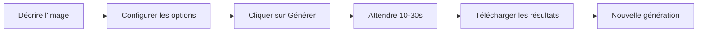

# 🎨 Guide de démarrage rapide - Génération d'Images IA

## Accès rapide

1. **Démarrer l'application**
   ```bash
   npm run dev
   ```

2. **Accéder à la page de génération**
   - Dashboard → "Générer des images"
   - Ou directement : http://localhost:3000/generate-images

## Utilisation basique

### 1. Génération simple (texte seul)

```
📝 Description : "Un magnifique coucher de soleil sur l'océan avec des vagues dorées"
⚙️ Options : 1 image, 1024x1024, Style photoréaliste, Qualité haute
```

### 2. Génération avec image source

```
📝 Description : "Transforme cette image en style cyberpunk avec des néons bleus"
🖼️ Image source : https://example.com/photo.jpg
⚙️ Options : 2 images, 1792x1024, Style artistique, Qualité ultra
```

## Options disponibles

| Option | Valeurs | Description |
|--------|---------|-------------|
| **Nombre d'images** | 1-4 | Nombre d'images à générer |
| **Dimensions** | 512x512, 1024x1024, 1792x1024 | Taille de l'image |
| **Style** | Photoréaliste, Artistique, Illustration, 3D | Style visuel |
| **Qualité** | Standard, Haute, Ultra | Niveau de détail |
| **Format** | PNG, JPEG, WebP | Format de sortie |

## Exemples de prompts

### 🌄 Paysage naturel
```
"Un lac de montagne cristallin entouré de forêts de pins, 
avec un lever de soleil doré se reflétant sur l'eau calme, 
brume matinale légère"
```

### 🎨 Art conceptuel
```
"Une ville futuriste cyberpunk avec des néons bleus et roses, 
des voitures volantes, des gratte-ciels immenses, 
pluie battante, style Blade Runner"
```

### 🐱 Portrait créatif
```
"Portrait d'un chat astronaute portant un casque spatial détaillé, 
reflets réalistes sur la visière, fond d'étoiles et de nébuleuses 
colorées, style photoréaliste"
```

### 🏛️ Architecture
```
"Temple japonais traditionnel au printemps, 
cerisiers en fleurs, architecture détaillée, 
lumière douce du crépuscule, style illustration aquarelle"
```

## Workflow typique



## Temps de génération

- **1 image** : ~10-15 secondes
- **2-4 images** : ~20-30 secondes
- **Avec image source** : +5-10 secondes

## Dépannage

### ❌ Erreur "Impossible de créer la génération"
- Vérifier que le backend est démarré sur `http://localhost:9006`
- Vérifier la variable `NEXT_PUBLIC_API_URL` dans `.env.local`

### ❌ Erreur "Timeout"
- La génération peut prendre jusqu'à 60 secondes
- Essayer avec moins d'images ou une qualité inférieure

### ❌ Image source non affichée
- Vérifier que l'URL de l'image est accessible publiquement
- Utiliser des URLs HTTPS de préférence

## Configuration requise

### Backend
```bash
# .env du backend
GOOGLE_API_KEY=votre_clé_api_google_ici
```

### Frontend
```bash
# .env.local
NEXT_PUBLIC_API_URL=http://localhost:9006
```

## Fonctionnalités

- ✅ Génération texte vers image
- ✅ Génération multimodale (texte + image)
- ✅ Jusqu'à 4 images simultanées
- ✅ 3 dimensions disponibles
- ✅ 4 styles artistiques
- ✅ 3 niveaux de qualité
- ✅ 3 formats d'export
- ✅ Prévisualisation en temps réel
- ✅ Téléchargement direct
- ✅ Métadonnées complètes

## Raccourcis clavier

| Touche | Action |
|--------|--------|
| `Ctrl/Cmd + Enter` | Soumettre le formulaire |
| `Esc` | Fermer les résultats |

## Astuces pour de meilleurs résultats

### 🎯 Prompts efficaces
1. **Soyez spécifique** : "Chat tigré orange" > "Chat"
2. **Ajoutez des détails** : Couleurs, textures, éclairage
3. **Mentionnez le style** : "style photoréaliste", "style anime"
4. **Incluez l'ambiance** : "mystérieux", "joyeux", "dramatique"

### 🖼️ Utilisation d'images sources
- Utiliser des images de haute qualité
- L'URL doit être accessible sans authentification
- Formats supportés : JPG, PNG, WebP

### ⚙️ Paramètres optimaux
- **Photoréalisme** : 1024x1024, Qualité Ultra, Style Photoréaliste
- **Art digital** : 1792x1024, Qualité Haute, Style Artistique
- **Illustrations** : 1024x1024, Qualité Haute, Style Illustration

## Support

- 📖 Documentation complète : `IMAGE_GENERATION_FEATURE.md`
- 🔧 API Backend : `docs-webhooks/IMAGE_GENERATION_API.md`
- 🐛 Signaler un bug : [GitHub Issues](https://github.com/Dipomin/sorami/issues)

---

**Propulsé par Google Gemini 2.0 Flash Experimental** 🚀
